# Docker Time

## Setup

Testing Docker installation by running `docker container run hello-world`:

  ```
  $ docker container run hello-world
  ```

<center></center>

## Our first containers

### Running my first container

  ```
  $ docker image pull alpine
  $ docker image ls
  $ docker container run alpine hostname
  $ docker container ls -a
  $ docker container run alpine echo "hello from alpine"
  $ docker container run alpine /bin/sh
  $ docker container run -it alpine /bin/sh
  ```

<center></center>

### Running an interactive Ubuntu container

  ```
  $ docker container run --interactive --tty --rm ubuntu bash
  # ls
  # ps aux
  # cat /etc/issue
  # exit
  ```

<center></center>

### Run a background MariaDB container

Creating the container:

  ```
  $ docker container run --detach --name mydb \
  --env MARIADB_ROOT_PASSWORD=my-secret-pw mariadb:latest
  $ docker logs mydb
  ```

<center></center>

Show running process inside of the container and MariaDB version:

  ```
  $ docker container top mydb
  $ docker container exec mydb ps -ef
  $ docker container exec -it mydb mariadb --user=root \
  --password=$MARIADB_ROOT_PASSWORD --version
  $ docker exec -it mydb sh
  # mariadb --user=root --password=$MARIADB_ROOT_PASSWORD --version
  # exit
  ```

<center></center>

## Deploying Webapps with Docker

### Run a static website in a container

Run the static-site container with the adjusted env variable AUTHOR:

  ```
  $ docker container run --name static-site --env AUTHOR="Michael Stucki" \
   --detach --publish-all dockersamples/static-site
  $ docker post static-site
  ```

<center></center>

Open the static site in browser:

<center></center>

## Webapps with Docker Part Deux

### Package and run a custom app using Docker

First, clone the lab repo to build the image.

  ```
  $ git clone https://github.com/dockersamples/linux_tweet_app
  ```

Create a new Docker image with `docker image build` command:

  ```
  $ cd ~/git/linux_tweet_app
  $ export DOCKERID=miglis
  $ docker image build --tag $DOCKERID/linux_tweet_app:1.0 .
  ```

<center></center>

Run the builded image:

```
$ docker image ls
$ docker container run --detach --publish --publish 8080:80 \
--name linux_tweet_app $DOCKERID/linux_tweet_app:1.0
```

<center></center>

### Modify a running website

Start the webapp with a bind mount.

```
$ sudo docker run --detach --publish 8080:80 --name linux_tweet_app \
 --mount type=bind,source="$(pwd)",target=/usr/share/nginx/html \
miglis/linux_tweet_app:1.0
```

<center>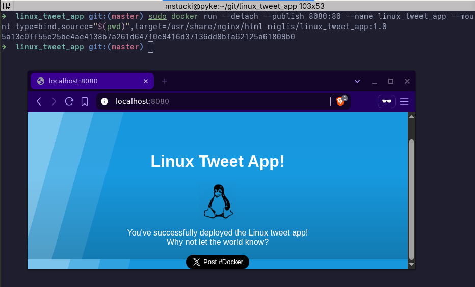</center>

Modify the running website, by copying a new `index.html` into the container.
For that we use the `index-new.html` provided by the `linux_tweet_app` repo.
After copying the new `index.html`file, I edited the line 33 and changed the
text to "Docker is Awesome! Kubernetes is more fun!"

```
$ cd ~/git/linux_tweet_app
$ cp index-new.html index.html
$ hx index.html
```

<center>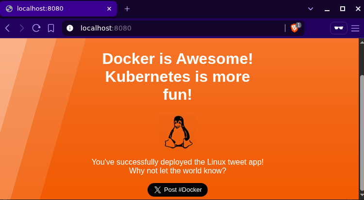</center>

### Creating my first image

With the new `index.html` file, I created new image with the tag `2.0`. 

```
$ cd ~/git/linux_tweet_app
$ sudo docker image build --tag miglis/linux_tweet_app:2.0 .
$ sudo docker image ls
```

<center>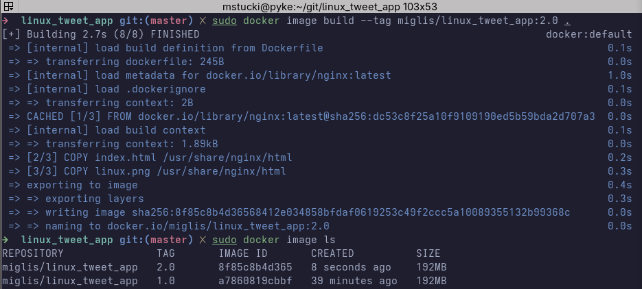</center>

Testing the new, as well as the old version.

```
$ sudo docker container run --detach --publish 8080:80 --name linux_tweet_app \
miglis/linux_tweet_app:2.0
$ sudo docker container run --detach --publish 8081:80 --name old_linux_tweet_app \
miglis/linux_tweet_app:1.0
$ sudo docker ps
```

<center>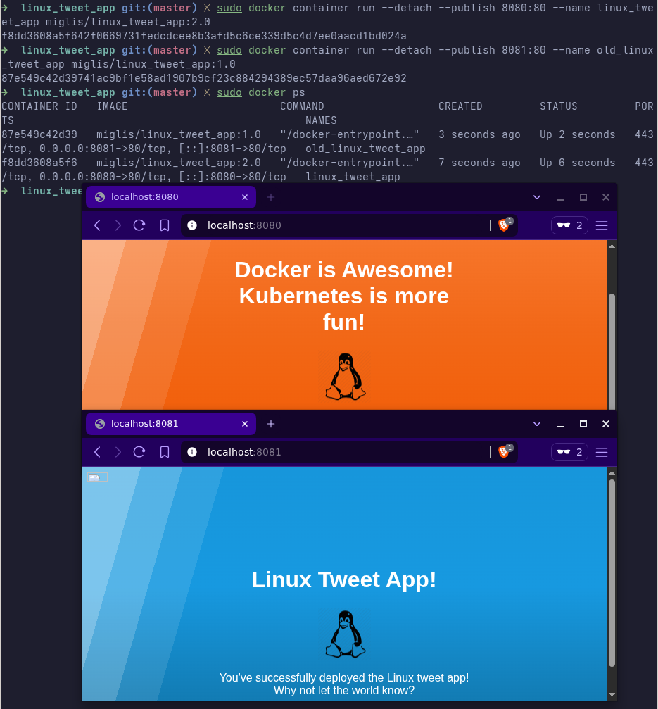</center>

## Docker and DevOps

### Pushing my image to DockerHub

Before pushing my images to DockerHub i rebuilded them with the correct Docker
ID, since i messed up a little bit.

```
$ sudo docker login -u stumi99 docker.io
$ sudo docker image ls
$ sudo docker image push stumi99/linux_tweet_app:1.0
$ sudo docker image push stumi99/linux_tweet_app:2.0
```

<center>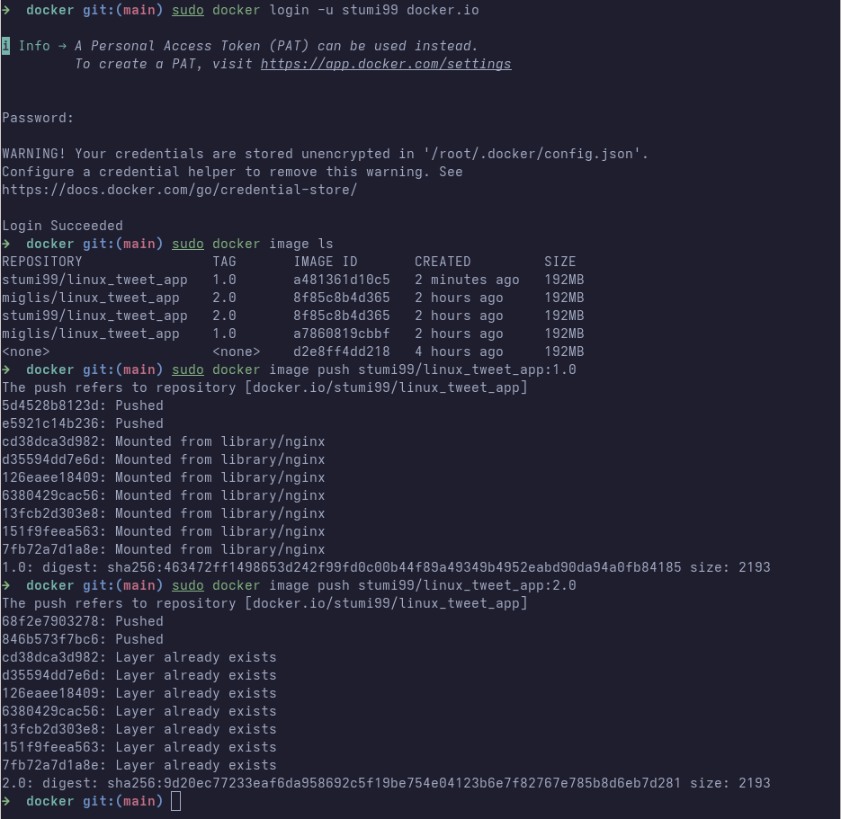</center>

After pushing the images to DockerHub, I checked if they are present.

<center>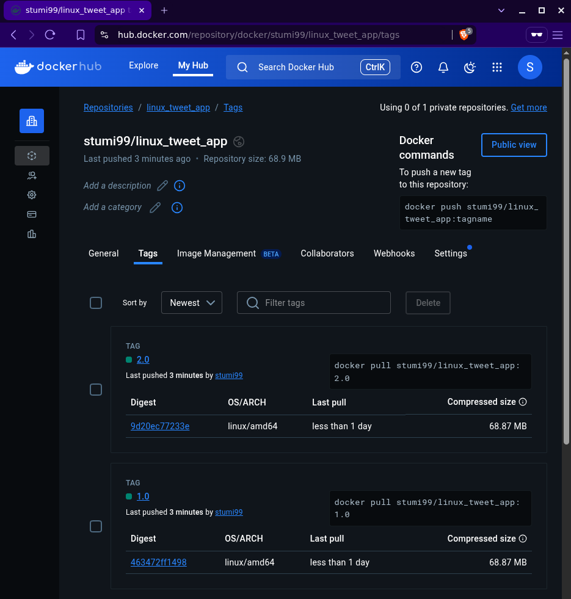</center>

### Setup an Automated Build

The newly created repo [bfh-cas-cld-docker-builds](https://github.com/MigliS/bfh-cas-cld-docker-builds)
which contains the automated build.

<center>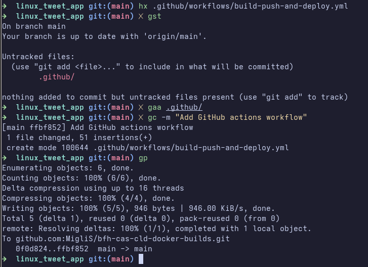</center>

After the initial commit, the workflow was triggered unsuccessfully due to the
personal access token I created with the wrong scopes.

<center>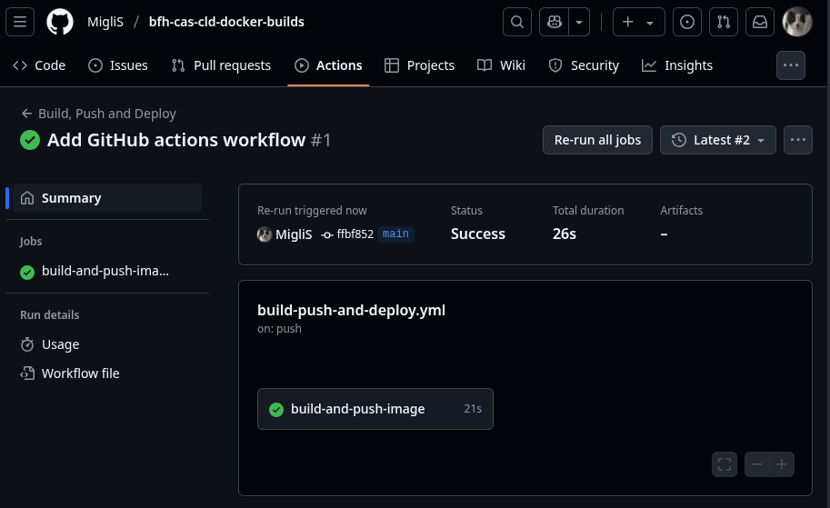</center>

To test the workflow i changed the title in the `index.html`.

<center>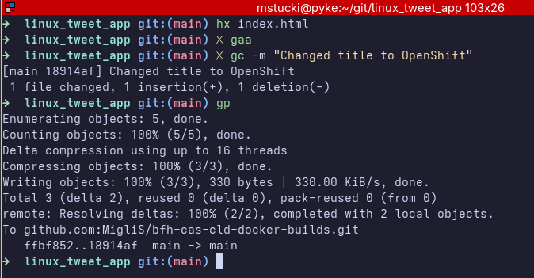</center>

<center>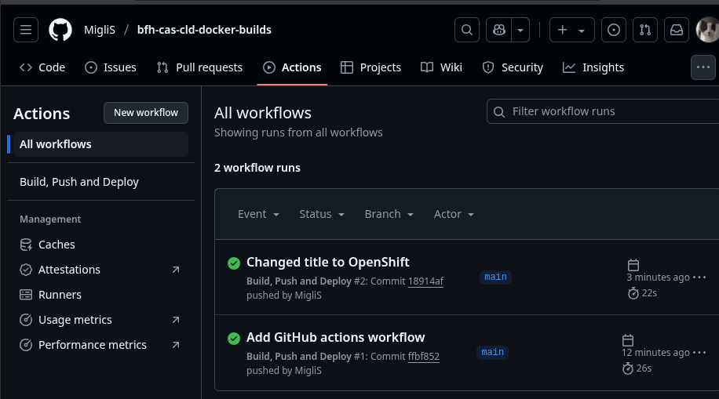</center>

### Implement some test

Adding the testing job and build status to the repo results in:

<center>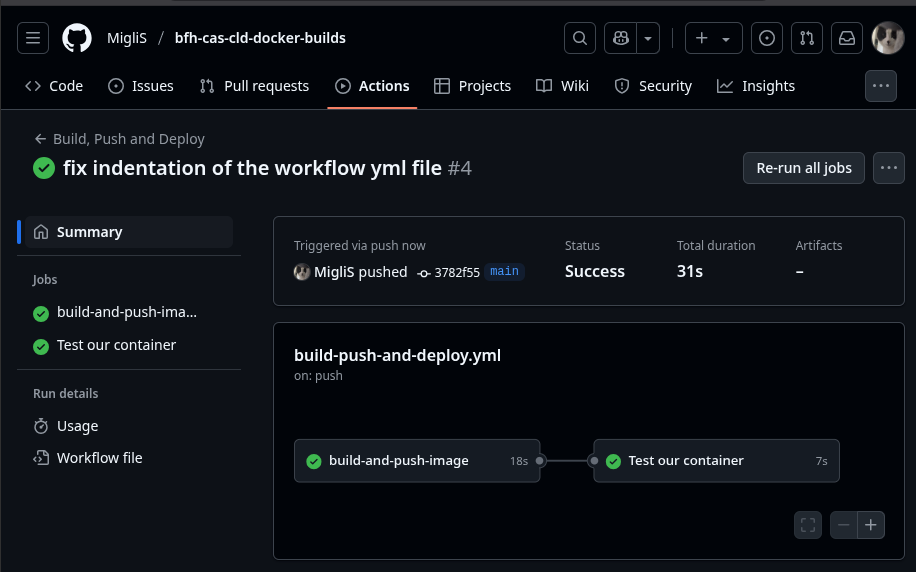</center>

<center>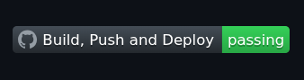</center>


